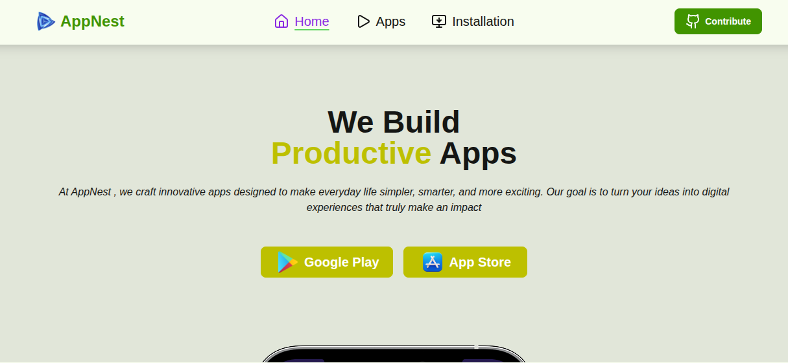
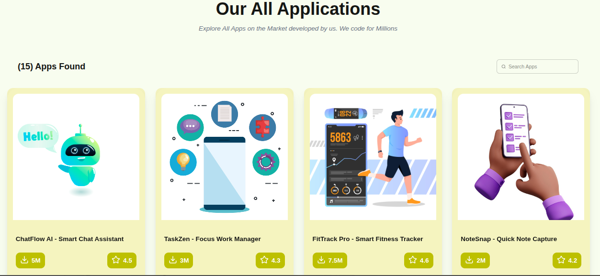
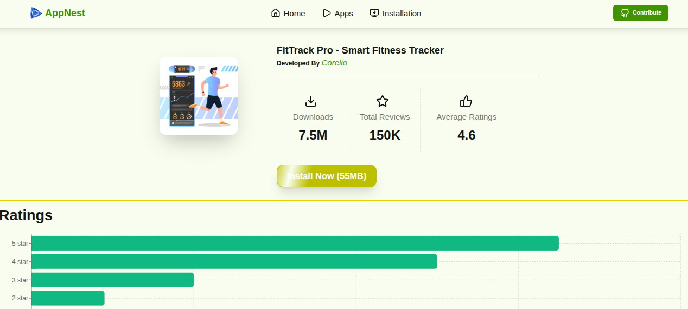
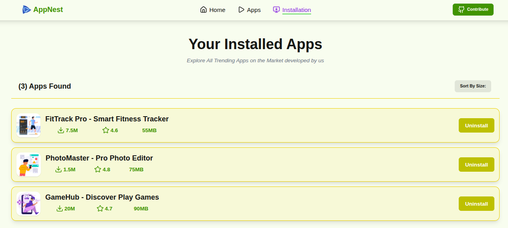

<p align="center">
  
</p>

# 📱 AppNest

> **A modern app marketplace built with React that lets users discover, explore, install, and manage trending applications through a fast, responsive, and intuitive user interface.**

<p align="center">
  
  
  
  
  
  
</p>

---

# 📖 Overview

**AppNest** is a modern web application designed to help users discover, explore, and manage trending applications effortlessly. It provides an engaging user experience with a clean interface, persistent installation management using Local Storage, and insightful application statistics.

The project demonstrates modern React development practices, reusable components, responsive UI design, and efficient state management.

---

# 🌐 Live Demo

🔗 **Live Website**

https://app-nest-alpha.vercel.app/

---


## 🏠 Home Page



---

## 📱 Applications



---

## 📄 App Details



---

## 📥 Installation Dashboard



---

# ✨ Features

### 📱 App Discovery

- Browse trending applications
- View detailed application information
- Clean and intuitive interface
- Responsive design for all devices

### 📥 Installation Management

- One-click app installation
- Uninstall installed applications
- Persistent installation data
- Local Storage integration

### 📊 Analytics & Insights

- Application ratings
- Total downloads
- User reviews
- Interactive statistics

### 📈 Sorting

- Sort by rating
- Sort by download count
- Ascending & descending order

### 🎨 User Experience

- Fast page navigation
- Toast notifications
- Interactive UI
- Responsive layout
- Modern design

---

# 🛠 Tech Stack

### Frontend

- React 18
- Vite
- React Router DOM
- Tailwind CSS
- Recharts
- React Toastify

### Storage

- Browser Local Storage

---

# 📂 Project Structure

```text
src/
│
├── assets/
│
├── components/
│   ├── Header/
│   ├── Footer/
│   ├── Home/
│   ├── Apps/
│   ├── AppCard/
│   ├── AppDetails/
│   ├── Installation/
│   ├── ErrorPage/
│   └── Root/
│
├── utilities/
│   └── localstorage.js
│
├── App.jsx
├── main.jsx
└── index.css
```

---

# 🚀 Getting Started

## Clone the Repository

```bash
git clone https://github.com/monirzkhan/appnest.git
```

Navigate to the project directory

```bash
cd appnest
```

Install dependencies

```bash
npm install
```

Start the development server

```bash
npm run dev
```

Build for production

```bash
npm run build
```

---

# 📦 Dependencies

- React
- React Router DOM
- Tailwind CSS
- Recharts
- React Toastify
- Vite

---

# 🚀 Future Improvements

- User Authentication
- Favorite Apps
- Search & Filtering
- Dark Mode
- Backend Integration
- User Reviews & Comments
- REST API Support
- Admin Dashboard
- Performance Optimization
- Progressive Web App (PWA)

---

# 💡 What I Learned

Through this project, I gained practical experience with:

- Building reusable React components
- Client-side routing using React Router
- Managing persistent data with Local Storage
- Creating responsive layouts using Tailwind CSS
- Data visualization using Recharts
- State management and component communication
- Modern UI/UX development practices

---

# 🤝 Contributing

Contributions are welcome.

1. Fork the repository
2. Create a new branch

```bash
git checkout -b feature-name
```

3. Commit your changes

```bash
git commit -m "Add new feature"
```

4. Push your branch

```bash
git push origin feature-name
```

5. Create a Pull Request

---

# 👨‍💻 Author

**Mohammad Moniruzzaman**

Frontend Developer

📧 Email: mmonirz.dev@gmail.com

💼 GitHub: https://github.com/monirzkhan

🌐 Portfolio: https://mmonirz-dev.vercel.app/

💼 LinkedIn: https://linkedin.com/in/monirzkhan-dev

---

# ⭐ Support

If you found this project helpful, consider giving it a **⭐ Star** on GitHub. It helps others discover the project and motivates further development.

---

# 📄 License

This project is licensed under the **MIT License**.